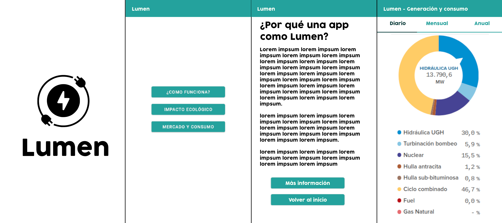

Primero nos encontramos con el **SplashScreen** formado por el logo y el nombre de la aplicación "LUMEN". (1ª imágen de la infografía)
A través de este nos llevará automaticamente tras finalizar una animación al **MainActivity** que es un pequeño menú
donde podemos elegir los distintos apartados de la aplicación "¿Como funciona?", "Impacto ecológico" y "Mercado y Consumo".

1. ¿Cómo funciona?

  - Contendrá un artículo que explicará nociones básicas sobre el sistema eléctrico, generación de energía, mercado eléctrico, impacto ambiental...
  
2. Impacto Ecológico - Mercado y Consumo

  - Estos apartados mostrarán estadísticas de sus datos correspondientes como podemos ver en la cuarta imágen de la infografía. Vamos a desarrollar
  una **Tabbed Activity** dividida en tres fragments que mostrarán las pestañas en las que se filtrarán las estadísticas por: dia, mes y año.
  

